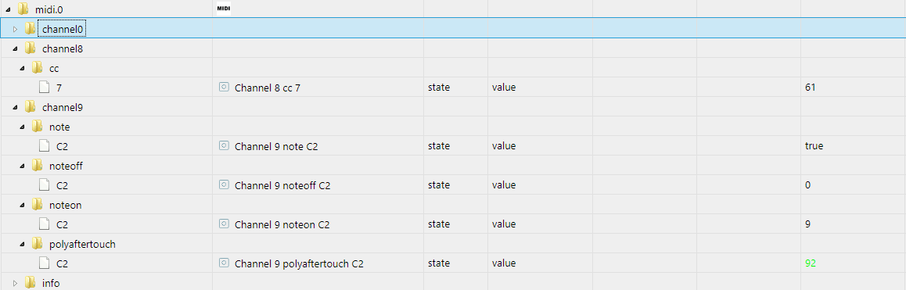

# ioBroker.midi

[](https://www.npmjs.com/package/iobroker.midi)
[](https://www.npmjs.com/package/iobroker.midi)


[](https://david-dm.org/boriswerner/iobroker.midi)
[](https://snyk.io/test/github/boriswerner/ioBroker.midi)

[](https://nodei.co/npm/iobroker.midi/)

## midi adapter for ioBroker

The adapter processes midi input using easymidi.

## Current Status
working:
- midi input
not working: 
- midi output (could be implementedt with the same library)
- device discovery in admin console

## Example
https://youtu.be/iHr_ertCmjE

I use a midi controller (in the video: Numark Orbit) to control my hue / zigbee lights.
This way you can make use of existing smart lighting for your next party instead of buying expensive light controllers and DMX enabled lights.
Of course this can be used together with the iobroker artnet adapter (https://github.com/ioBroker/ioBroker.artnet) to even make more use of it.

Currently I use the hue-extended adapter (https://github.com/Zefau/ioBroker.hue-extended) to control my hue lights. Make sure to disable the queueing in the instance configuration of the hue-adapter in order to not have a delay.

Following a simple script (JS view of blockly script) to activate a hue light when a button is pressed and deactivate it when releasing:
```
on({id: 'midi.0.channel0.note.D-1', change: "ne"}, function (obj) {
  var value = obj.state.val;
  var oldValue = obj.oldState.val;
  if (getState("midi.0.channel0.note.D-1").val == true) {
    setState("hue-extended.0.lights.002-hue_bloom_esszimmer.action.on"/*Hue bloom Esszimmer - Switch light on / off*/, true);
  }
  if (getState("midi.0.channel0.note.D-1").val == false) {
    setState("hue-extended.0.lights.002-hue_bloom_esszimmer.action.on"/*Hue bloom Esszimmer - Switch light on / off*/, false);
  }
});
```
Of course there can be many more things done, e.g. using aftertouch to control dimming time, velocity to control light intesity or color and much more.

### States
- noteon
  - value represents the velocity of the noteon [0-127]
- noteoff
  - value represents the velocity of the noteoff [0-127]
- note
  - set to true when the noteon was seen for the note and set to false when the noteoff was seen for the note
- control change
  - value represents the value of the command (most of the times set to 127 when cc button is pushed, false when released) [0-127]
- poly aftertouch
  - value represents the pressure of the aftertouch [0-127]
- program change
  - boolean
- position
  - value of 0-16384

Some of the states are interdependent, in the following example you can see the interaction of a key with polyaftertouch.
The screenshot was done after the button was pressed (noteon velocity was 9, current aftertouch 92, the note C2 shows true, which indicates that the button is still pressed)

After releasing the button the note went to false, the aftertouch to 0. noteon velocity is still 9 (as no new noteon was triggered). Noteoff velocity was not triggered from this key.

## Setup
In instance configuration insert the device id in the Midi In text field.
On adapter startup the log will show an info:
`(29332) Available MIDI Input Devices: Midi Through:Midi Through Port-0 14:0,Samson Graphite M25:Samson Graphite M25 MIDI 1 20:0`
This line represents two devices:
- `Midi Through:Midi Through Port-0 14:0`
- `Samson Graphite M25:Samson Graphite M25 MIDI 1 20:0`

The whole string has to be pasted to the configuration.

## Changelog

### 0.0.4
* (Boris Werner) refactored object creation

### 0.0.3
* (Boris Werner) fixed velocity issue with noteon/noteoff with boolean note, removed (not working) device dropdown

### 0.0.2
* (Boris Werner) implemented basic midi input

### 0.0.1
* (Boris Werner) initial release from template

## License
MIT License

Copyright (c) 2021 Boris Werner <iobroker@boriswerner.eu>

Permission is hereby granted, free of charge, to any person obtaining a copy
of this software and associated documentation files (the "Software"), to deal
in the Software without restriction, including without limitation the rights
to use, copy, modify, merge, publish, distribute, sublicense, and/or sell
copies of the Software, and to permit persons to whom the Software is
furnished to do so, subject to the following conditions:

The above copyright notice and this permission notice shall be included in all
copies or substantial portions of the Software.

THE SOFTWARE IS PROVIDED "AS IS", WITHOUT WARRANTY OF ANY KIND, EXPRESS OR
IMPLIED, INCLUDING BUT NOT LIMITED TO THE WARRANTIES OF MERCHANTABILITY,
FITNESS FOR A PARTICULAR PURPOSE AND NONINFRINGEMENT. IN NO EVENT SHALL THE
AUTHORS OR COPYRIGHT HOLDERS BE LIABLE FOR ANY CLAIM, DAMAGES OR OTHER
LIABILITY, WHETHER IN AN ACTION OF CONTRACT, TORT OR OTHERWISE, ARISING FROM,
OUT OF OR IN CONNECTION WITH THE SOFTWARE OR THE USE OR OTHER DEALINGS IN THE
SOFTWARE.
